# Chrome devtool Chrome开发调试工具

CHROME开发工具提供的工具将帮助你在一个惊人的WEB平台开发。这里有一些提示，你可能还不知道

* 拖在元素面板
* 参考当前选定的元素在控制台
* 在控制台上操作使用价值
* 添加CSS和编辑元件状态
* 找到一个CSS属性的定义
* 保存到文件的修改CSS
* 截图一个元素
* 发现使用CSS选择器的元素
* 移位进入控制台
* 清除控制台
* 去…
* 监视表达式
* XHR /取调试
* DOM修改调试

## 拖在元素面板
在元素面板你可以拖放任何HTML元素和改变其位置在页面

Drag and Drop in the Elements Panel
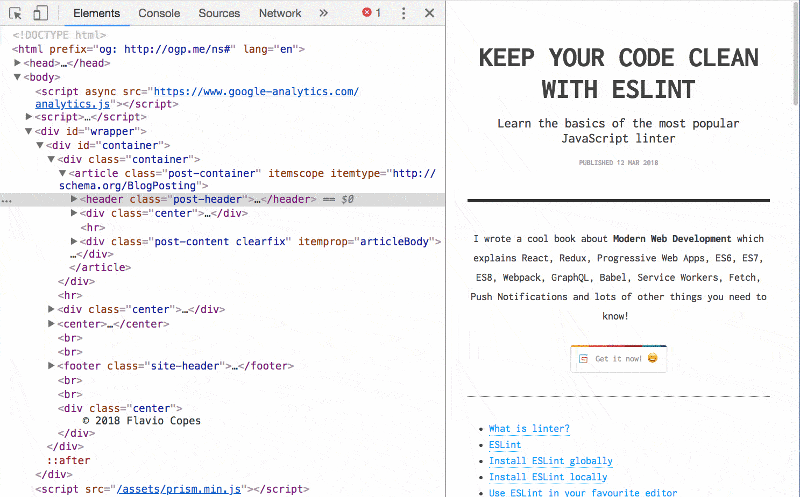

## 参考当前选定的元素在控制台
选择在内容面板的一个节点，和类型`$0`在控制台参考吧

Reference elements in the Console
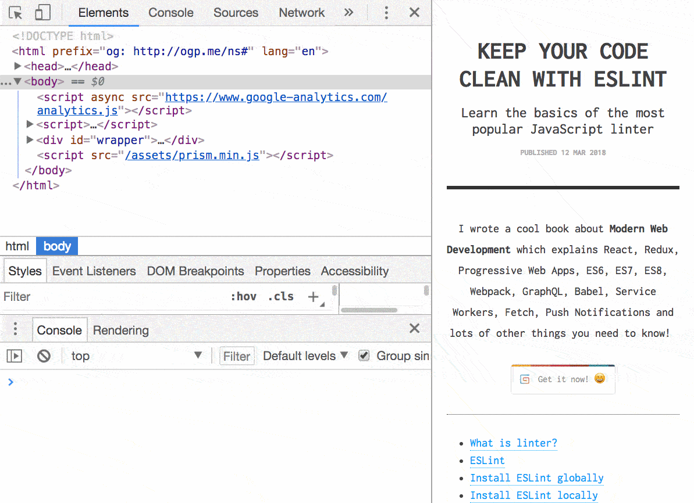

提示：如果你使用jQuery，你可以进入$($0)访问jQuery API这个元素。

## 在控制台上操作使用价值
使用$_参考在控制台执行前一个操作的返回值

Use the last result
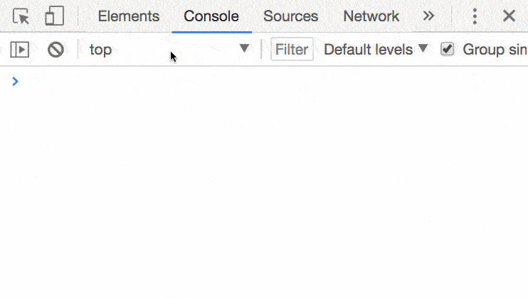

## 添加CSS和编辑元件状态
在元素面板有2个超级有用的按钮。

第一个让你添加一个新的CSS属性，任何选择你想要但预填充当前选中的元素：

Add a CSS rule
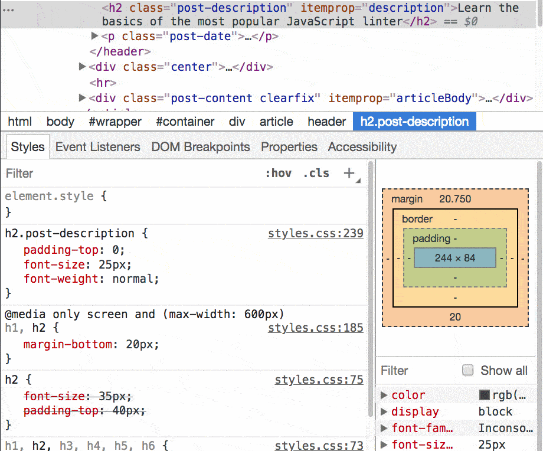

另一个让你触发所选元素的状态，所以你可以看到风格应用时它是活跃的，盘旋，焦点。

Element state
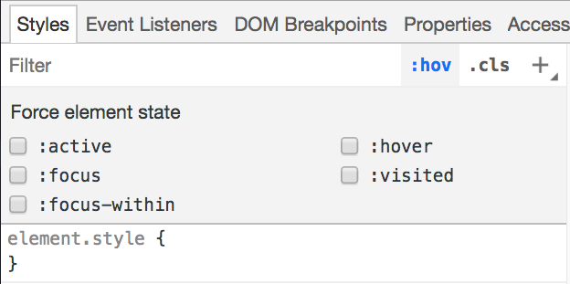

## 找到一个CSS属性的定义
cmd-click（按Ctrl点击在Windows）在元素的CSS属性工具面板，将指引你去的地方，是指，在源面板

Find where a CSS property is defined
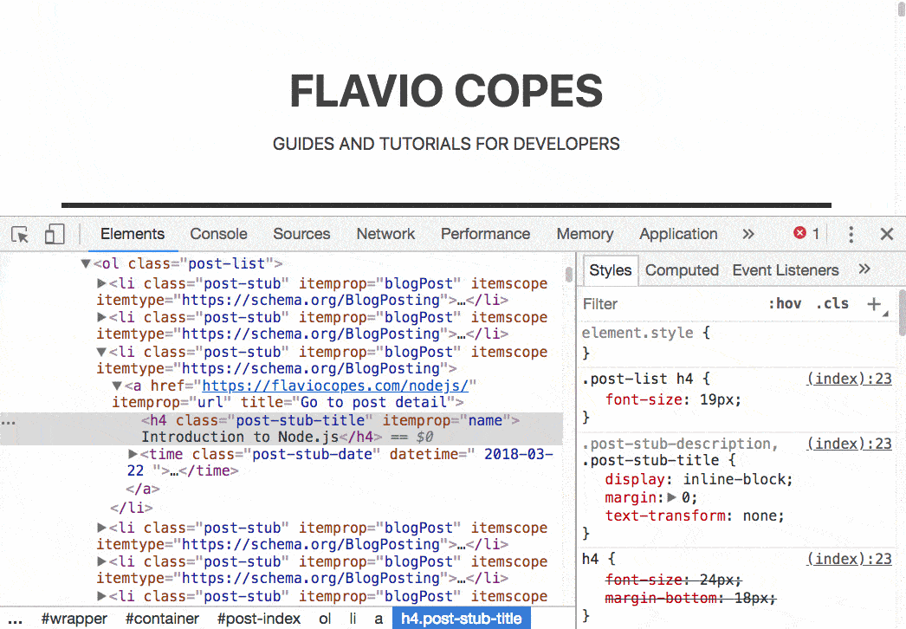

## 保存到文件的修改CSS
单击编辑CSS文件的名字。检查员打开到源窗格和从那里你可以用你的生活应用。

这一招没有新的选择器工作增加使用，或为element.style性质，但只有修改现有的。

Save to File the modified CSS
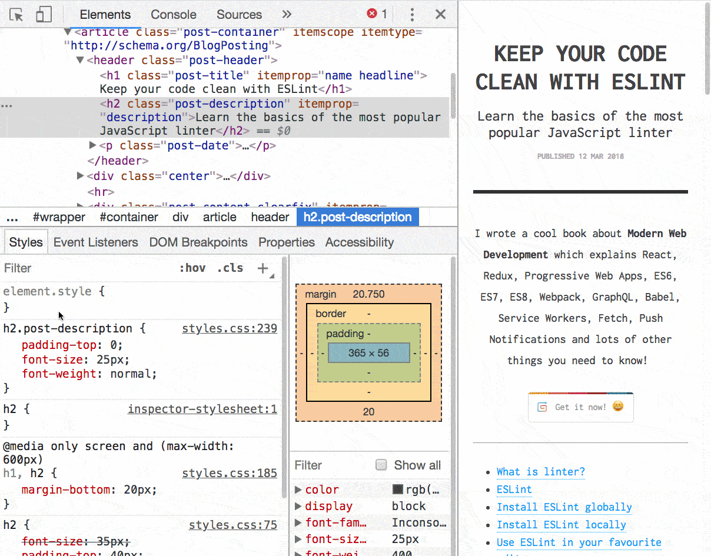

## 截图一个元素
选择一个元素和新闻cmd-shift-p（或ctrl-shift-p在Windows）打开命令菜单，选择节点捕捉截图

Screenshot a single element
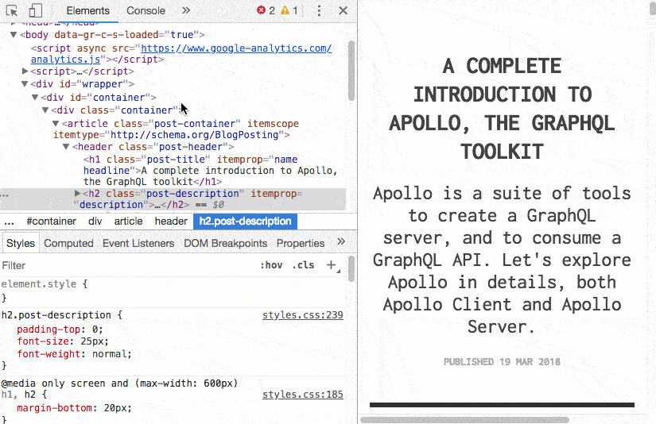

## 发现使用CSS选择器的元素
紧迫的cmd-f（按在Windows）搜索框在元素面板打开。

你可以在那里任意字符串匹配的源代码，或者你也可以使用CSS选择器有铬为您生成一个图像：

Find an element using CSS selectors
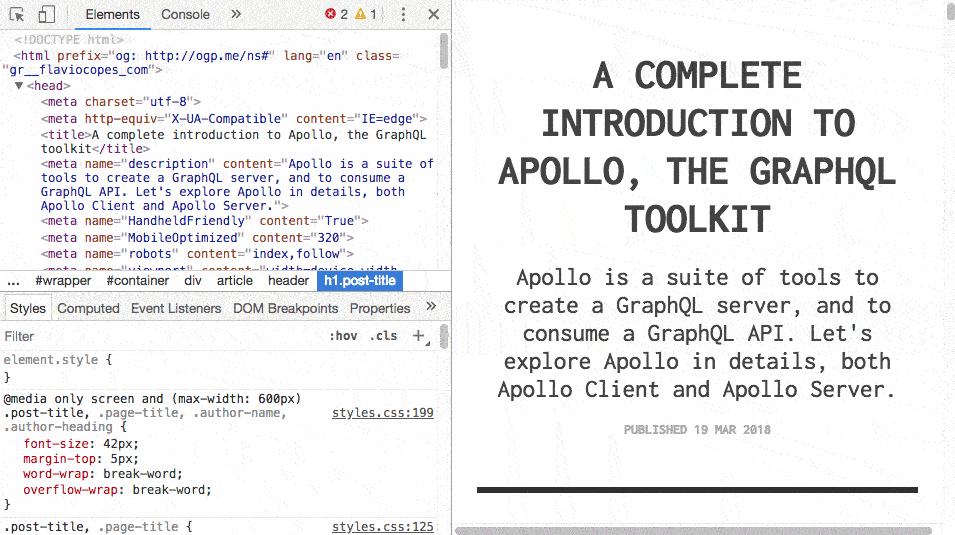

## 移位进入控制台
写命令，跨越在控制台多行，按shift-enter

一旦你准备好了，按回车键在脚本结束时执行它：

Shift-enter in the Console
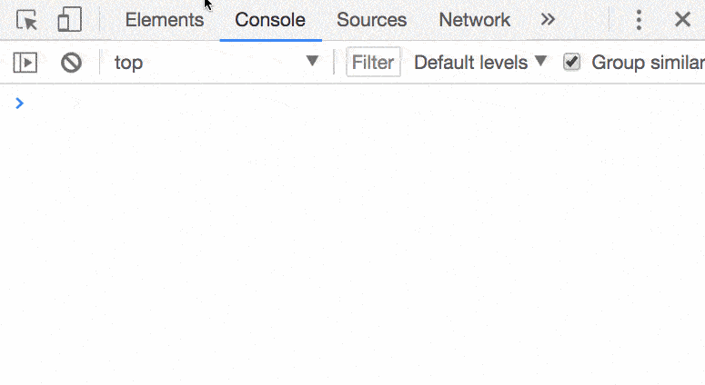

## 清除控制台
你可以清除控制台使用清空在控制台左上角的按钮，或按下ctrl-l或CMD - K

去…
在资源面板：

cmd-o（按Ctrl O在Windows），显示所有的文件到你的页面加载。
cmd-shift-o（ctrl-shift-o在Windows）显示符号（性质、功能、类别）在当前文件。
ctrl-g去到一个特定的线
Files list
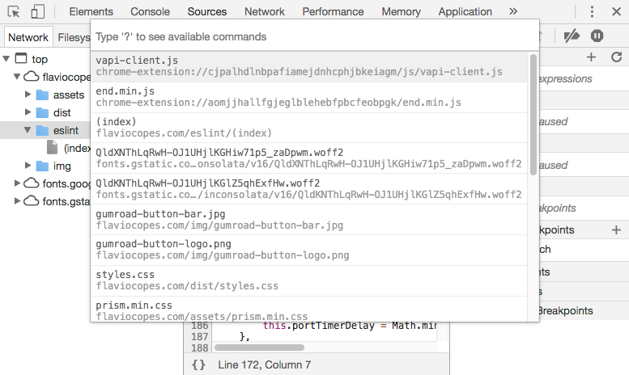

## 监视表达式
而不是写一次又一次的变量名或表达你要调试会话期间检查了一番，将它添加到监视表达式列表

Watch Expressions
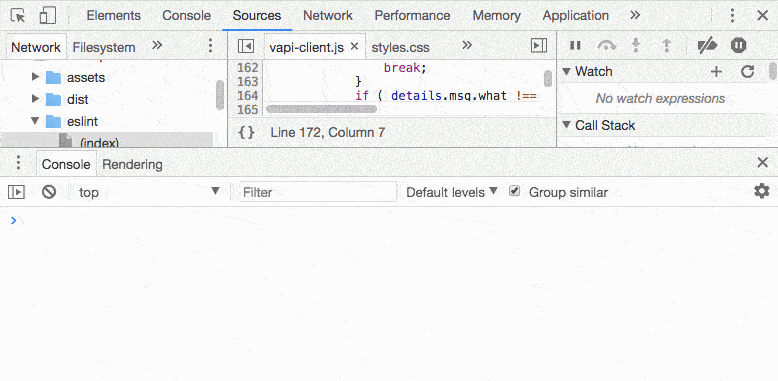

## XHR /取调试
从调试器打开breakpoints XHR /取面板

你可以打破任何时间XHR/取呼叫被发送，或者只是对特定的人：

XHR and Fetch debugging
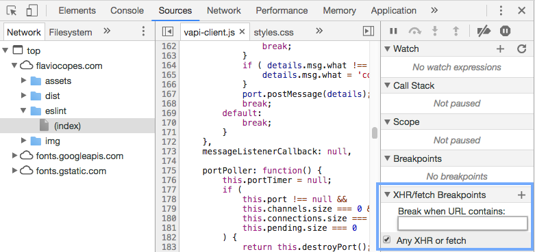

## DOM修改调试
右键单击一个元素使打破子树的修改：只要脚本遍历元素的孩子和改变它们，调试器自动停止让你检查发生了什么。
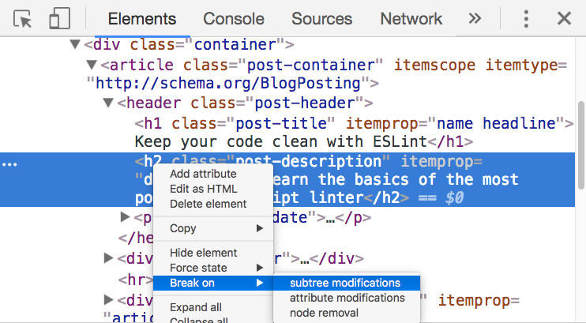

